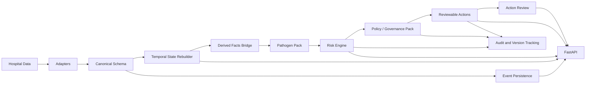
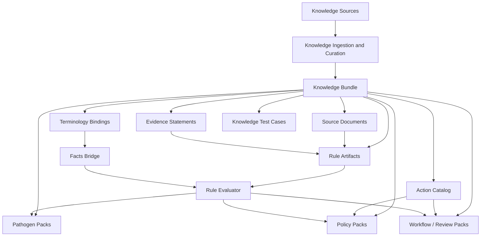

# Current Architecture Diagram

Status: current
Scope: presentation of the current implemented backend flow and current knowledge-layer placement
Last meaningful change: 2026-04-05

Purpose: capture the architecture as it exists in the current Phase 0 scaffold, rather than the full intended end-state.

This note captures the current CodeBlue architecture as it exists in the Phase 0 backend scaffold.

## Runtime Pipeline

## Knowledge Layer Placement

## Stable vs Variable Layers

Stable platform layers:

- Canonical schema
- Temporal state reconstruction
- Knowledge ingestion and curation
- Derived facts and rule evaluation
- Risk/output contracts
- Orchestration flow
- Audit and version tracking
- API shell

Variable layers:

- Hospital data adapters
- Pathogen packs
- Policy/governance packs
- Review workflow packs
- Knowledge bundle contents
- Presentation layer
