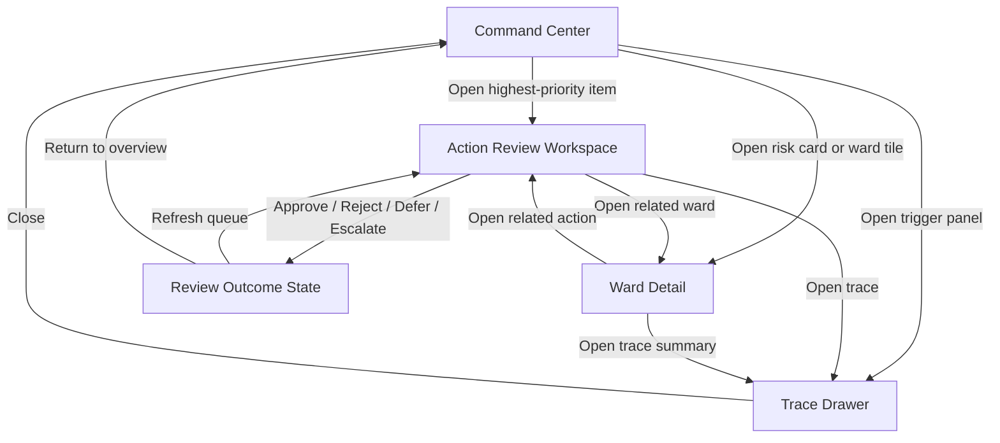

# Frontend Screen Specification

Status: current
Scope: concrete V1 screen contracts, UI elements, states, and backend dependencies for the first CodeBlue frontend
Last meaningful change: 2026-04-07

Purpose: translate the frontend UX plan into an implementable screen-by-screen contract for the hackathon and Phase 0 product slice.

This note is the concrete follow-up to [frontend-ux-plan.md](/home/kauar/CodeBlue/docs/architecture/frontend-ux-plan.md). It defines what the first frontend should actually contain, what each screen owns, and which current backend endpoints can support it.

## Current Prototype In Plain Terms

The sample HTML prototype is a clickable visual mockup of the first product slice.

In simple terms, it contains:

- a left navigation rail with the four main surfaces;
- a `Command Center` screen with summary cards, an action queue, ward cards, and trigger panels;
- an `Actions` screen with an inbox on the left and the selected recommendation detail on the right;
- a `Wards` screen with one ward-focused operational view;
- a `Trace` drawer that explains why a recommendation exists;
- a fake `Run Assessment` button that updates the timestamp and simulates a new cycle; and
- review buttons such as approve, reject, defer, and escalate.

What it is showing conceptually is:

- what the operator sees first;
- how they move from overview to action review;
- how they inspect ward context; and
- how they understand the reasoning behind a recommendation.

What it is not doing:

- it is not connected to the live API;
- it is not loading real database data;
- it is not the actual frontend codebase;
- it is a presentation-grade prototype, not the final app.

## Frontend Stack Decision

The frontend stack decision and the rationale for each tool live in [frontend-stack-justifications.md](/home/kauar/CodeBlue/docs/architecture/frontend-stack-justifications.md).

The short version is:

- `React`
- `TypeScript`
- `Vite`
- `React Router`
- `TanStack Query`
- `Zustand`
- hand-authored CSS with tokens and CSS modules

The intended relationship to the current HTML prototype is:

- same overall product shape;
- same information architecture;
- same design direction;
- but not pixel-perfect identical implementation.

## Frontend Goal

The first frontend should let an operator do four things clearly:

- understand the current outbreak situation;
- see where attention should go first;
- review and disposition recommended actions; and
- understand why the system produced them.

The frontend should feel like an operational control surface, not like a generic analytics dashboard and not like a chatbot shell.

## Primary User

For V1, optimize for a single primary user:

- infection prevention or hospital operations lead.

This user:

- works under time pressure;
- needs prioritization more than raw detail;
- needs traceability before trust; and
- should be able to act without learning a complex interface.

## Product Surface For V1

The first frontend should have four main surfaces:

1. `Command Center`
2. `Action Review Workspace`
3. `Ward Detail`
4. `Trace Drawer`

The first implementation should be desktop-first. Mobile should remain readable, but it should not dictate the layout.

## Navigation Contract

Keep navigation small and explicit:

- `Command Center`
- `Actions`
- `Wards`
- `Trace`

For the hackathon, `Trace` can be implemented as a drawer instead of a full page.

## Current Screen Count For The First Real Frontend

The first real frontend should implement:

1. `Command Center`
2. `Actions`
3. `Ward Detail`
4. `Trace Drawer`

That is enough to:

- show the product clearly;
- support the live demo path;
- and avoid overbuilding before the backend runtime path is deeper.

## Screen 1: Command Center

Purpose:

- provide immediate situational awareness;
- show what is urgent;
- direct the operator into the review workflow.

### Layout

Use a three-zone layout:

- top command bar;
- summary metrics band;
- three-column operational body.

### Top Command Bar

Must show:

- `Site name`
- `Current seasonality state`
- `Last successful assessment run`
- `Run Assessment` primary button

Recommended right-side status tokens:

- database/API health
- active bundle name or bundle id

### Summary Metrics Band

The summary band should contain five compact cards.

#### Card 1: Pending High-Priority Actions

Fields:

- large number
- label: `High-Priority Pending`
- subtext: `Awaiting review`

Behavior:

- click opens the action inbox filtered to high-priority items

Current backend support:

- derivable from [actions.py](/home/kauar/CodeBlue/src/codeblue/api/routes/actions.py)

#### Card 2: High-Risk Wards

Fields:

- large number
- label: `High-Risk Wards`
- subtext: `Current assessment`

Behavior:

- click opens wards sorted by risk

Current backend support:

- partially derivable from [risk.py](/home/kauar/CodeBlue/src/codeblue/api/routes/risk.py)

Backend gap:

- a dedicated ward summary endpoint would improve this

#### Card 3: Isolation Capacity Pressure

Fields:

- state badge: `Normal`, `Watch`, or `Constrained`
- label: `Isolation Capacity`
- short note explaining why

Behavior:

- click opens related actions or constraints

Current backend support:

- not fully exposed yet

Backend gap:

- dedicated capacity context in the runtime facts or summary endpoint

#### Card 4: Respiratory Burden

Fields:

- level indicator
- label: `Respiratory Burden`
- optional change hint such as `rising`

Behavior:

- click opens trigger/trace context

Current backend support:

- not fully surfaced yet

Backend gap:

- summary endpoint or compiled trigger-context endpoint

#### Card 5: Review Queue Size

Fields:

- count
- label: `Open Review Queue`
- subtext: `All priorities`

Behavior:

- click opens the Action Review Workspace

Current backend support:

- derivable from [actions.py](/home/kauar/CodeBlue/src/codeblue/api/routes/actions.py)

### Operational Body

#### Left Column: Prioritized Action Queue

This is the most important panel on the Command Center.

Each action row should show:

- urgency badge
- action title
- target label
- short rationale
- required reviewer role
- current status
- timestamp or created-at label

Primary interactions:

- click row to open Action Review Workspace
- quick filter by urgency or status

Recommended list ordering:

1. highest urgency
2. oldest pending within same urgency

#### Center Column: Ward Risk Board

This should be a compact board of ward cards, not a dense table.

Each ward card should show:

- ward name
- risk level badge
- short burden summary
- vulnerability marker if relevant
- count of linked pending actions
- latest trigger or signal summary

Primary interactions:

- click card to open Ward Detail

Current backend support:

- partially derivable from risk assessments and state

Backend gap:

- cleaner ward-level aggregation endpoint

#### Right Column: Trigger And System Panel

This panel should show:

- latest active triggers
- current seasonality state
- last run outcome
- active knowledge bundle id
- small system health signal

Primary interactions:

- open trace drawer
- inspect why a trigger fired

Current backend support:

- mixed

Backend gap:

- dedicated trigger-trace payload

## Screen 2: Action Review Workspace

Purpose:

- let the operator disposition recommendations quickly and confidently.

### Layout

Use a two-pane layout:

- left: action inbox
- right: selected action detail

### Left Pane: Action Inbox

Each action item must show:

- action title
- target
- urgency
- status
- short rationale
- required reviewer role

Recommended filters:

- `All`
- `High`
- `Pending`
- `By ward`
- `By reviewer role`

Recommended grouping:

- `Needs immediate attention`
- `Pending review`
- `Recently reviewed`

### Right Pane: Action Detail

The detail pane should have six sections.

#### Section 1: Action Header

Must show:

- action title
- urgency badge
- status badge
- target
- reviewer role
- action timing expectation

#### Section 2: Why This Was Recommended

Must show:

- primary rationale sentence
- triggered rule ids or trigger ids
- knowledge bundle id
- linked assessment id if present

Current backend support:

- [actions.py](/home/kauar/CodeBlue/src/codeblue/api/routes/actions.py)
- [explainability.py](/home/kauar/CodeBlue/src/codeblue/api/routes/explainability.py)

#### Section 3: Operational Context

Should show:

- ward or room context
- related risk level
- capacity constraints if applicable
- timing relevance

Current backend support:

- partial

Backend gap:

- richer explainability payload

#### Section 4: Evidence And Trace

Should show:

- source documents
- rules or triggers
- context facts
- audit reference

For the hackathon this can be compact and read-only.

#### Section 5: Review Controls

Must include:

- `Approve`
- `Reject`
- `Defer`
- `Escalate`

Must also include:

- rationale text area
- reviewer role display or selection if needed

#### Section 6: Outcome Confirmation

After submission, the user should see:

- resulting status
- timestamp
- review rationale summary
- audit confirmation

### Interaction Contract

Approving or rejecting should not navigate away automatically. The operator should remain in the workspace and see the result update in place.

## Screen 3: Ward Detail

Purpose:

- explain why a ward is a current operational focus.

This can start as a full page or a large drawer. For the hackathon, a drawer is often enough.

### Ward Header

Must show:

- ward name
- current risk badge
- vulnerability marker
- current linked action count
- current burden summary

### Section 1: Why This Ward Matters

Must show:

- top risk factors
- latest linked triggers
- recent noteworthy events

This section should be readable in under ten seconds.

### Section 2: Timeline

Should show a chronological list of:

- symptom-related arrivals
- lab confirmations
- relevant room or ward context changes
- review actions affecting the ward

This can begin as a simple vertical event list.

### Section 3: Rooms Or Unit Context

Should show:

- relevant rooms
- occupancy or room type where relevant
- vulnerability or exposure markers

This does not need a full floor-plan visualization yet.

### Section 4: Actions Affecting This Ward

Must show:

- pending actions
- status
- urgency
- owner/reviewer role

Primary interaction:

- open selected action in Action Review Workspace

### Section 5: Trace Summary

Should show:

- most important fired trigger
- most important rule or evidence link
- knowledge bundle reference

## Screen 4: Trace Drawer

Purpose:

- support trust, explainability, and demo credibility.

This should open from either:

- a Command Center trigger panel;
- an action detail pane; or
- a ward detail view.

### Trace Drawer Sections

#### 1. Decision Summary

Show:

- what action was produced
- for what target
- at what time

#### 2. Trigger Or Rule Chain

Show:

- trigger ids
- rule ids
- matched facts or contextual modifiers

#### 3. Knowledge Source Context

Show:

- bundle id
- source document ids or titles
- policy source references where available

#### 4. Audit Context

Show:

- audit reference
- current review status
- last review action if one exists

## Current Backend Support Versus Gaps

### Already Usable Now

- `GET /health`
- `POST /api/v1/events`
- `GET /api/v1/events`
- `GET /api/v1/state`
- `POST /api/v1/runs`
- `GET /api/v1/risk/assessments`
- `GET /api/v1/risk/alerts`
- `GET /api/v1/actions`
- `POST /api/v1/actions/{action_id}/review`
- `GET /api/v1/explainability/actions/{action_id}`

### Enough For A Basic Frontend Now

The current backend is already enough for:

- a simple Command Center;
- an action inbox;
- an action detail panel;
- a minimal trace drawer.

### Not Yet Cleanly Supported

The current backend is not yet ideal for:

- dashboard summary cards;
- ward-first aggregation;
- compiled-trigger trace visibility;
- deployment-profile visualization;
- capacity or burden summary panels.

These are the most useful backend additions for the next frontend iteration.

## Backend Data Contract

This section records what information the frontend should pull from the rest of the system.

### Global Application Data

#### Health And Environment

Source:

- `GET /health`

Current fields:

- `status`
- `app`
- `env`

Frontend use:

- topbar health token
- environment banner in non-production modes

#### Run Trigger

Source:

- `POST /api/v1/runs`

Current fields:

- `snapshot_at`
- `assessment_count`
- `alert_count`
- `action_count`

Frontend use:

- `Run Assessment` button
- last run metadata
- optimistic dashboard refresh trigger

### Command Center Data

#### Action Queue

Source:

- `GET /api/v1/actions`

Current fields used:

- `action_id`
- `action_definition_id`
- `action_type`
- `category`
- `execution_mode`
- `target_scope`
- `target_id`
- `rationale`
- `required_reviewer_role`
- `status`
- `constraints_applied`
- `knowledge_bundle_id`
- `triggering_rule_ids`
- `created_at`

Frontend use:

- high-priority pending count
- queue cards
- review queue size
- links into action detail

#### Risk And Alerts

Source:

- `GET /api/v1/risk/assessments`
- `GET /api/v1/risk/alerts`

Current fields used from assessments:

- `assessment_id`
- `entity_scope`
- `target_id`
- `time_window`
- `score`
- `priority`
- `generated_by`
- `knowledge_bundle_id`
- `triggering_rule_ids`
- `context_facts`
- `contributing_signals`

Current fields used from alerts:

- `alert_id`
- `assessment_id`
- `target_id`
- `priority`
- `summary`
- `top_signals`

Frontend use:

- ward risk board
- dashboard urgency signals
- summary cards

#### State Snapshot

Source:

- `GET /api/v1/state`

Current use:

- support ward detail context
- show current room and ward occupancy summary
- timeline anchoring

Backend note:

The current state endpoint is useful, but the frontend will become much cleaner once the backend exposes ward-focused aggregation more directly.

### Action Review Workspace Data

#### Reviewable Actions

Source:

- `GET /api/v1/actions`

Frontend use:

- action inbox
- selected action header
- status and reviewer role
- current queue filtering

#### Review Submission

Source:

- `POST /api/v1/actions/{action_id}/review`

Request content:

- `reviewer_role`
- `decision`
- `rationale`

Frontend use:

- approve
- reject
- defer
- escalate

#### Action Explanation

Source:

- `GET /api/v1/explainability/actions/{action_id}`

Current fields:

- `action_id`
- `explanation`
- `assessment_id`

Frontend use:

- action detail reasoning block
- trace drawer initial narrative

### Ward Detail Data

Current likely sources:

- `GET /api/v1/state`
- `GET /api/v1/risk/assessments`
- `GET /api/v1/actions`

Frontend-composed fields:

- ward risk summary
- linked pending actions
- recent relevant events
- vulnerability markers

Backend gap:

The frontend would benefit from a dedicated ward summary endpoint later, because the current ward screen would otherwise have to assemble too much from multiple route payloads.

## Backend Gaps That Matter Most For The Frontend

The most useful backend additions for the real frontend are:

- `GET /api/v1/dashboard/summary`
- `GET /api/v1/wards`
- `GET /api/v1/wards/{ward_id}`
- richer `GET /api/v1/explainability/actions/{action_id}`
- trigger-trace or compiled-runtime trace endpoints

These are product-supporting endpoints, not merely convenience helpers.

## Required UI States

Every major panel should define:

- loading state
- empty state
- error state
- populated state

### Empty State Guidance

The system should never show empty tables without explanation.

Examples:

- `No actions pending. Run an assessment or ingest events.`
- `No ward risks available yet.`
- `No trace data available for this action.`

### Error State Guidance

Errors should be operational and plain:

- what failed
- whether the user can retry
- whether the last successful data is still being shown

## Visual Priority Rules

Use visual emphasis in this order:

1. urgent actions
2. risk concentration
3. constraints or capacity pressure
4. traceability and provenance
5. system health

The UI should not give the same visual weight to everything.

## Recommended MVP Build Order

Build in this order:

1. Command Center shell
2. Action Review Workspace
3. Trace Drawer
4. Ward Detail Drawer

This order matches both the demo flow and the current backend surface.

## Screen Flowchart

## Frontend Test Flow

This is the clean test path for the complete frontend.

### 1. Landing Test

Open the app and verify:

- Command Center loads;
- health token appears;
- topbar shows site and last run area;
- summary cards render;
- action queue renders;
- ward board renders.

If this fails, the first suspects are:

- app boot failure
- route wiring
- dashboard data loading

### 2. Run Test

Click `Run Assessment` and verify:

- button is responsive;
- loading state appears;
- last run timestamp updates;
- counts or queue data refresh;
- no silent failure occurs.

If this fails, suspect:

- run endpoint integration
- query invalidation / refetch
- optimistic state mismatch

### 3. Action Review Test

Open the top action and verify:

- action detail opens;
- rationale is visible;
- reviewer role is visible;
- knowledge or trace references are visible;
- review buttons are enabled.

Then submit a review decision and verify:

- status updates;
- queue changes appropriately;
- confirmation appears;
- action does not disappear incorrectly.

If this fails, suspect:

- action selection state
- review mutation wiring
- local cache refresh

### 4. Ward Detail Test

Open a ward from the dashboard and verify:

- ward header loads;
- linked actions appear;
- timeline appears;
- opening a related action returns to the correct action detail.

If this fails, suspect:

- ward aggregation logic
- route parameter handling
- cross-screen state synchronization

### 5. Trace Test

Open the trace drawer from:

- dashboard trigger panel
- action detail
- ward detail

Verify:

- drawer opens and closes cleanly;
- reasoning text appears;
- source references appear;
- no stale data remains from a previous item.

If this fails, suspect:

- selected object state
- explainability query handling
- drawer lifecycle

## Simple Acceptance Standard

The first frontend is in good shape when:

- an operator can land on Command Center and understand the situation immediately;
- the highest-priority recommendation can be reviewed in one click;
- the related ward context is understandable;
- the reasoning behind the recommendation is visible;
- a review decision updates the UI cleanly;
- the interface feels like an operational tool, not a generic admin scaffold.

## Recommended Next Backend Contract Work

The frontend plan suggests these backend additions:

- dashboard summary endpoint
- ward aggregation endpoint
- richer explainability payload
- trace payload for compiled trigger-action runtime
- deployment-profile summary endpoint

Those should be treated as product-supporting endpoints, not incidental helpers.
