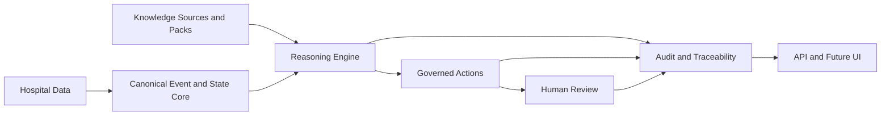

# High-Level Architecture

Status: current
Scope: presentation-friendly essential architecture view for CodeBlue
Last meaningful change: 2026-04-05

Purpose: provide the simplest architecture view that still preserves the core product idea and system flow.

This is the presentation-friendly version of the CodeBlue architecture. It keeps only the essential blocks and the main system flow.

## Essential View

## What Each Block Means

- `Hospital Data`: patient movement, lab results, ward context, and other operational events.
- `Canonical Event and State Core`: the stable internal schema plus temporal hospital-state reconstruction.
- `Knowledge Sources and Packs`: evidence tables, local guidelines, workflow logic, and the curated bundles built from them.
- `Reasoning Engine`: rule evaluation, pathogen interpretation, risk generation, and policy application.
- `Governed Actions`: structured reviewable outputs, not autonomous commands.
- `Human Review`: approval, rejection, deferral, escalation, and override.
- `Audit and Traceability`: provenance, versioning, and runtime decision history.
- `API and Future UI`: the delivery surface for operators and integrations.

## Short Summary

CodeBlue takes hospital events, interprets them through stable internal models plus portable knowledge packs, produces governed reviewable actions, and preserves a full audit trail for human-supervised outbreak response.
