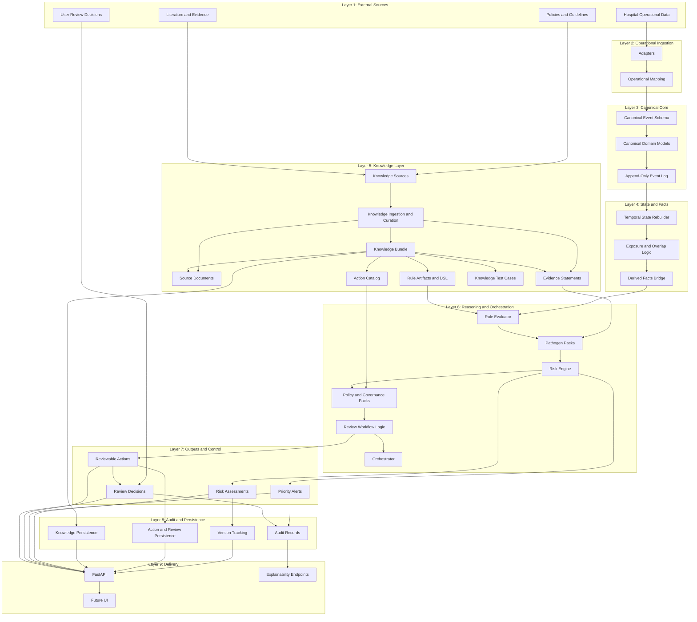

# Overall Architecture Layers

Status: current
Scope: layer-by-layer architecture view of the full CodeBlue system
Last meaningful change: 2026-04-05

Purpose: show CodeBlue as a layered architecture instead of only a request pipeline, with the major responsibilities separated by layer.

This diagram shows CodeBlue as a layered architecture rather than only as a request pipeline.

## Layered View

## Layer Summary

1. External sources provide operational data, policy material, evidence, and human review input.
2. Operational ingestion normalizes hospital-system inputs into canonical event forms.
3. The canonical core stores the platform's stable internal contracts.
4. The state and facts layer reconstructs hospital state and exposes rule-ready facts.
5. The knowledge layer includes source ingestion, curation, and portable runtime knowledge objects.
6. The reasoning layer evaluates rules, applies pathogen and policy logic, and orchestrates execution.
7. The output layer surfaces structured risks, alerts, and reviewable actions.
8. The audit and persistence layer records versions, decisions, and traceability artifacts.
9. The delivery layer exposes the system through API and future UI surfaces.
